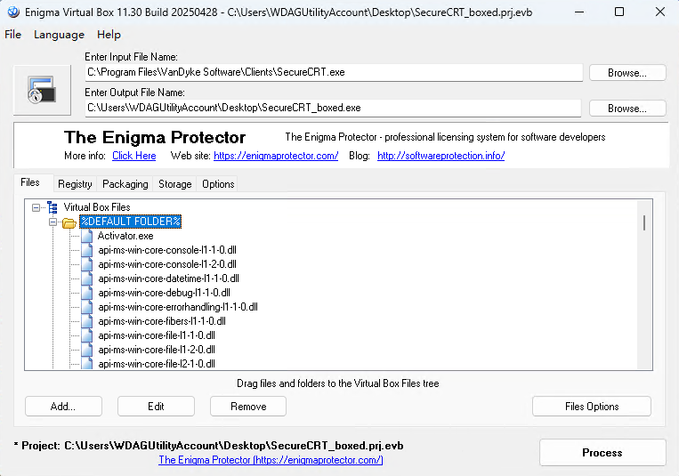
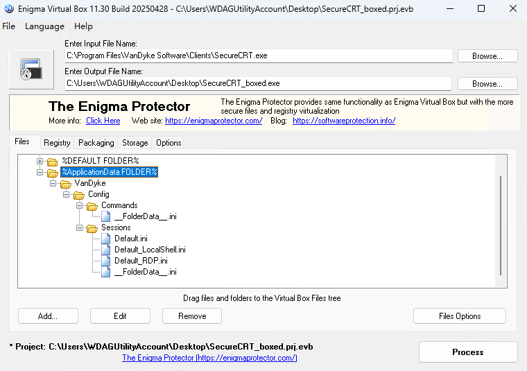
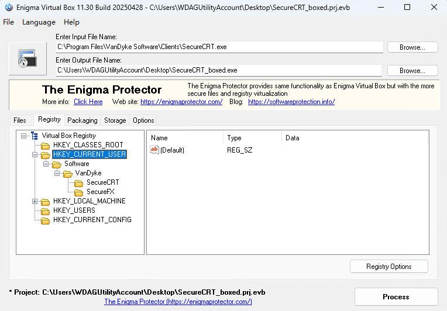
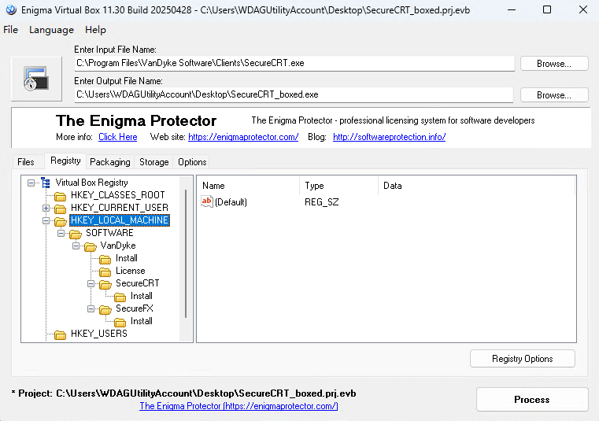
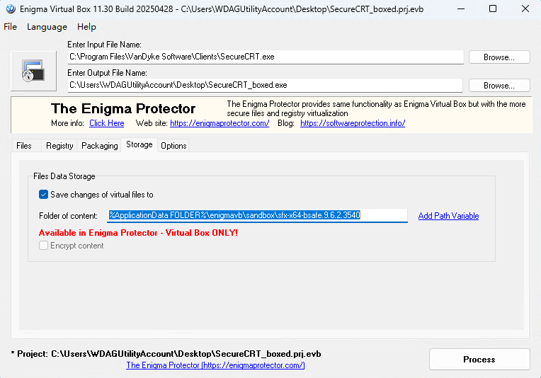

我们使用 [Enigma Virtual Box](https://enigmaprotector.com/en/aboutvb.html) 对 [ SecureCRT + SecureFX](https://www.vandyke.com/cgi-bin/releases.php?product=securecrt) 进行打包。

<!-- more -->

## Files 配置

假设 SecureCRT 安装在 `C:\Program Files\VanDyke Software\Clients` 目录中，则：

1. 添加 `C:\Program Files\VanDyke Software\Clients` 为 `%DEFAULT FOLDER%`。

2. 添加 `C:\Users\WDAGUtilityAccount\AppData\Roaming\VanDyke` 为 `%ApplicationData FOLDER%\VanDyke`。

注意保留 `Config\Commands` 和 `Config\Sessions` 下的所有内容。其他内容可以删除。

## Registry 配置

1. 注册表导入 `%HKEY_CURRENT_USER%\Software\VanDyke` 下所有内容。注意去除 `Config Path` 项目。

2. 注册表导入 `%HKEY_LOCAL_MACHINE%\Software\VanDyke` 下所有内容。注意去除 `Main Directory` 项目。

## Storage 配置

勾选 `Save changes of virtual files to` 复选框，并设置文件保存路径为 `%ApplicationData FOLDER%\enigmavb\sandbox\sfx-x64-bsafe.9.6.2.3540`

